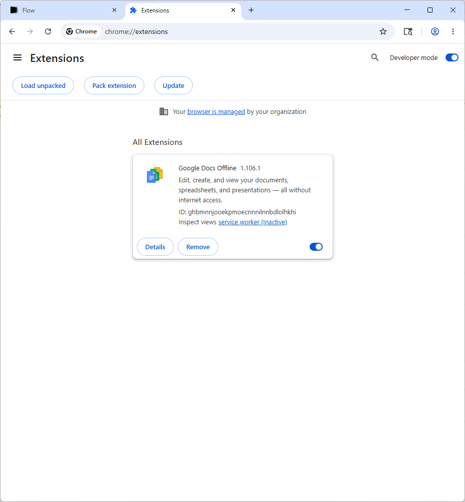
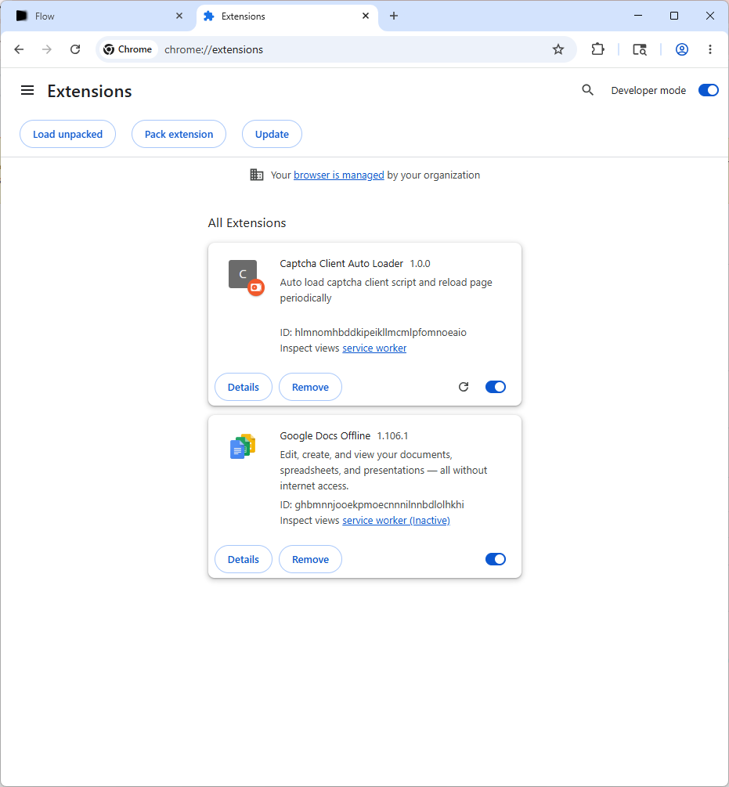
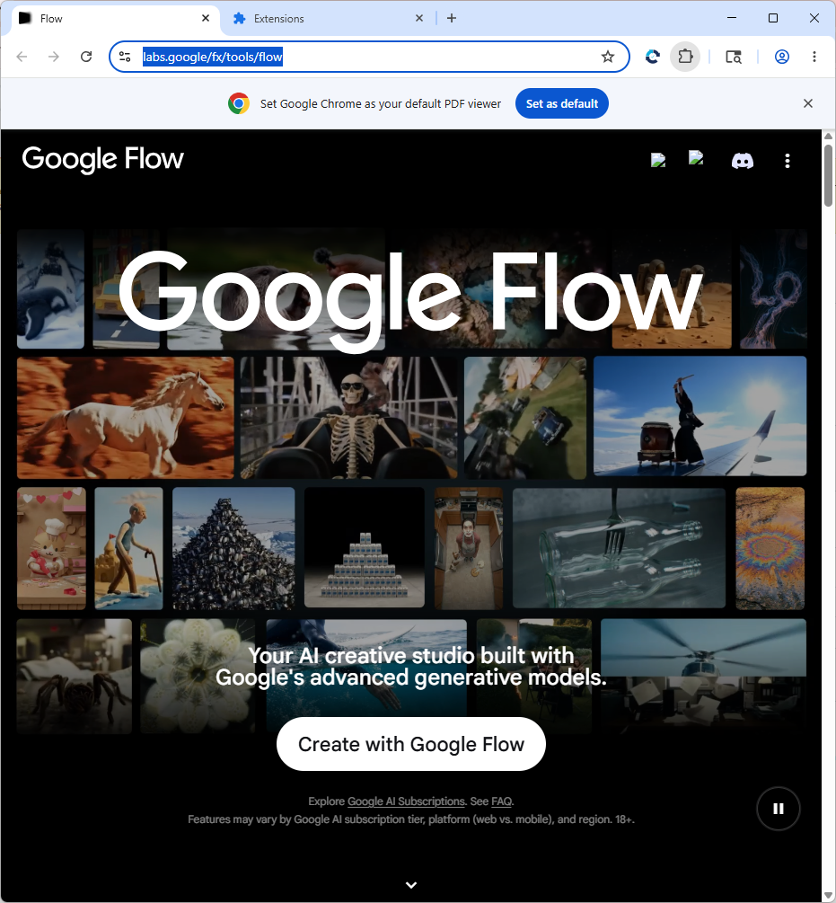
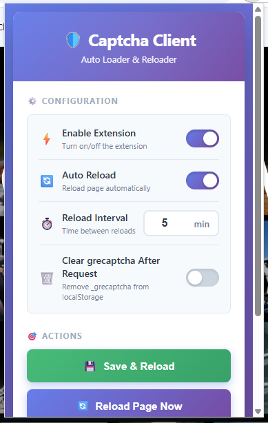
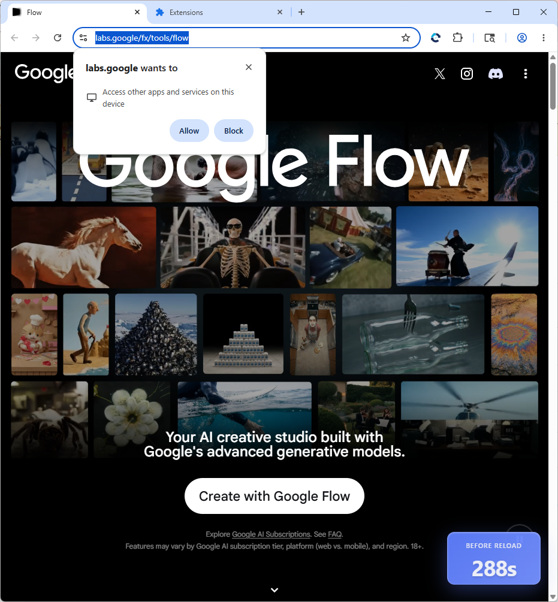

# ViVe AI — Hướng Dẫn Cài Đặt & Sử Dụng

> **Phần mềm tạo video AI tự động** sử dụng Google Veo 3.1

---

## 📋 Yêu Cầu Hệ Thống

| Yêu cầu | Chi tiết |
|----------|----------|
| **Hệ điều hành** | Windows 10 (21H2+) / Windows 11 |
| **Google Chrome** | Phải cài sẵn trên máy |
| **Tài khoản Gmail** | Bất kỳ tài khoản Gmail nào |

> ⚠️ **Không cần cài thêm** Node.js, Python hay bất kỳ phần mềm nào khác.

---

## 🚀 Bước 1: Cài Đặt

1. Tải file **`ViVe AI_1.0.0_x64-setup.exe`** từ [Releases](../../releases)
2. Chạy file cài đặt
3. Nhấn **Next** → **Install** → Đợi cài xong → **Finish**
4. Shortcut **ViVe AI** sẽ xuất hiện trên Desktop

---

## 🔑 Bước 2: Kích Hoạt Bản Quyền

1. Mở **ViVe AI** từ shortcut trên Desktop
2. Lần đầu mở, app sẽ hiển thị **Key máy** (Hardware ID) của bạn
3. **Copy key** này và gửi qua **Zalo** cho Admin
4. Admin sẽ kích hoạt key cho bạn trong hệ thống
5. Sau khi được kích hoạt, mở lại app để bắt đầu sử dụng

---

## 🌐 Bước 3: Đăng Nhập Gmail Trên Chrome

Khi mở app, **Chrome sẽ tự động mở** một cửa sổ riêng. Đây là Chrome chuyên dụng của ViVe AI.

1. Trên cửa sổ Chrome vừa mở, **đăng nhập vào Gmail** bất kỳ
2. Chrome sẽ tự chuyển đến trang `labs.google/fx/tools/flow`
3. **Giữ cửa sổ Chrome này mở** — không đóng nó lại

---

## 🧩 Bước 4: Cài Extension Captcha (Chỉ Làm 1 Lần)

### 4.1 — Mở trang Extensions

Trên cửa sổ Chrome của ViVe AI:
1. Gõ vào thanh địa chỉ: `chrome://extensions` rồi nhấn **Enter**

### 4.2 — Bật Developer Mode

1. Ở góc **trên bên phải** trang Extensions, tìm công tắc **"Developer mode"**
2. **Bật ON** (gạt sang phải, chuyển sang màu xanh)

---

### 4.3 — Tải và Cài đặt Extension

1. Sau khi bật Developer mode, nhấn nút **"Load unpacked"** (góc trên bên trái).
2. Một hộp thoại chọn thư mục sẽ hiện ra. Điều hướng đến thư mục cài đặt ViVe AI theo đường dẫn mặc định:
   `C:\Users\<Tên_User>\AppData\Local\ViVe AI\resources\extension`
   *(Mẹo tìm nhanh: Click chuột phải vào shortcut **ViVe AI** trên Desktop -> Chọn **Open file location** -> Vào tiếp thư mục `resources` -> Chọn thư mục `extension`)*
3. Chọn thư mục `extension` và nhấn **Select Folder**.
4. Extension **ViVe AI Helper** sẽ xuất hiện trong danh sách.

*Hình ảnh hướng dẫn cài đặt:*

---

### 4.4 — Ghim và Kích Hoạt Extension

1. Click vào biểu tượng **Mảnh ghép (Extensions)** trên thanh công cụ của Chrome.
2. Tìm **ViVe AI Helper** và click vào biểu tượng **Cây ghim (Pin)** để ghim extension lên thanh công cụ.
3. Click vào biểu tượng của extension vừa ghim, chọn **"Server and Reload"**.
4. Nếu trên màn hình xuất hiện thông báo cấp quyền từ **labs.google**, vui lòng nhấn **"Allow"** (Cho phép) để xác nhận.

*Hình ảnh hướng dẫn ghim & kích hoạt:*

---

## 🏁 Bước 5: Kiểm Tra Trạng Thái & Sử Dụng

1. Trên giao diện phần mềm ViVe AI, quan sát **2 chỉ báo trạng thái**:
   - 🟢 **Captcha = Sẵn sàng (Màu Xanh)**: Extension đã kết nối và giải captcha thành công.
   - 🟢 **Tokens = Sẵn sàng (Màu Xanh)**: Token đã tải xong từ server.
2. **⚠️ QUAN TRỌNG:** Chỉ bắt đầu nhập prompt và chạy tool khi **CẢ HAI** chỉ báo đều chuyển sang màu **XANH**.
3. Nếu chạy khi chỉ báo còn màu đỏ, video sẽ bị lỗi hoặc không sinh được.
